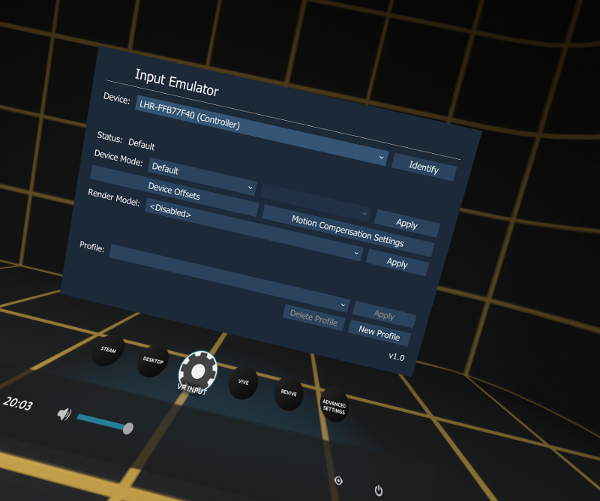
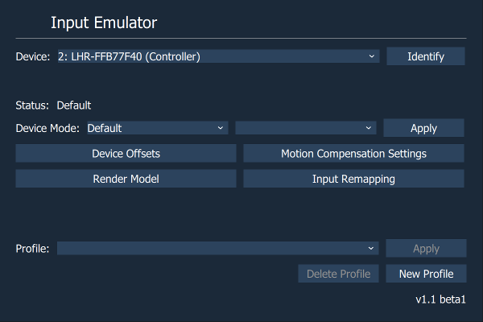
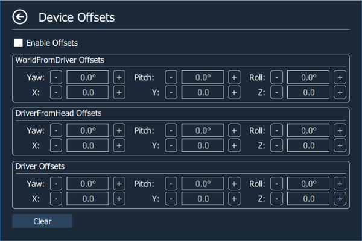
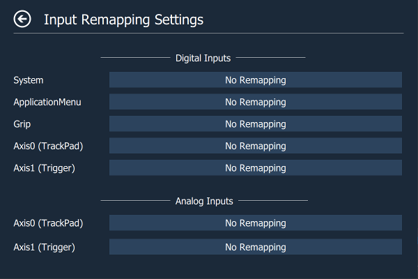
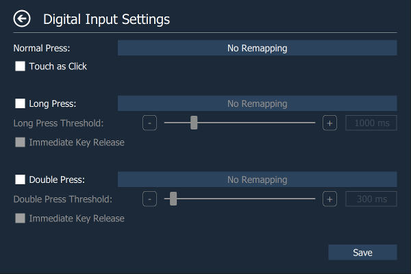
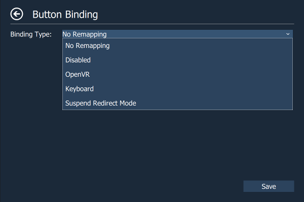
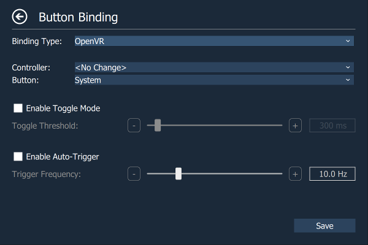
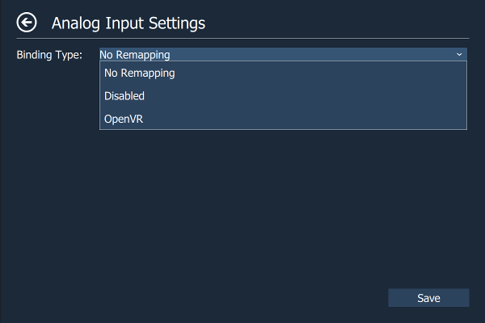
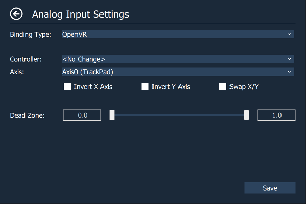

    

# OpenVR-InputEmulator

An OpenVR driver that allows to create virtual controllers, emulate controller input, enable motion compensation, manipulate poses of existing controllers and remap buttons. Includes a dashboard to configure some settings directly in VR, a command line client for more advanced settings, and a client-side library to support development of third-party applications.



The OpenVR driver hooks into the HTC Vive lighthouse driver and allows to modify any pose updates or button/axis events coming from the Vive controllers before they reach the OpenVR runtime. Due to the nature of this hack the driver may break when Valve decides to update the driver-side OpenVR API.

The motivation of this driver is that I want to make myself a tracked gun that is guaranteed to work in any SteamVR game regardless of whether the original dev wants to support tracked guns or not. To accomplish this I need some way to add translation and rotation offsets to the poses of the motion controllers so that I can line up my tracked gun and the gun in the game. Additionally I need a way to easily switch between the tracking puck on my gun and my motion controller with the game thinking it's still the same controller (Throwing grenades with a tracked gun is not fun). But this driver should also support other use cases. 

There is also a client-side API which other programs can use to communicate with the driver. This API should be powerful enough to also support the development of full-fledged motion-controller drivers.

# Features

- Add translation and rotation offsets to the pose of existing controllers.
- Redirect the pose from one controller to another.
- Swap controllers.
- Motion  compensation for 6-dof motion platforms.
- Create virtual controllers and control their positions and rotations.
- Emulate controller input.
- Remap controller buttons.
- ...

# Notes:

This is a work-in-progress and may contain bugs.

# Usage

## Installer

Download the newest installer from the [release section](https://github.com/matzman666/OpenVR-InputEmulator/releases) and then execute it. Don't forget to exit SteamVR before installing/de-installing.

## Command-Line Client

Download the newest command-line client from the [release section](https://github.com/matzman666/OpenVR-InputEmulator/releases), unzip it, and then execute the contained binary in a cmd window. Enter *'client_commandline.exe help'* on the command line for usage instructions.


# Documentation

## Fallout 4 VR specific Fixes

There is an Oculus Touch specific fix available for Fallout 4 VR. It allows to emulate trackpad behaviour with the Rift's joysticks. Therefore, on the [input remapping pages](https://github.com/matzman666/OpenVR-InputEmulator#analog-input-settings) of each analog axis a touchpad emulation mode can be configured. 

Currently there are two modes available:

- **Position Based**: This modes assumes that the joystick can only move further away from the center position. All newer positions smaller can the last known position are ignored. The saved highest position is reset when the center position has been reached. The idea is to ignore input events caused by the joystick snapping back to center position. As soon as the center position is reached it is immediately send to the application in a position update. This helps with movement controls as otherwise any movement in an application is not reset when the joystick is let go by the user, and FO4 menus ignore this position update. However, the pipboy map does not ignore this position update.

- **Position Based (Deferred Zero Update)**: This modes works exactly the same as the mode above with one small difference. The position update when the center position is reached is not immediately send but only when the joystick starts moving again. This helps with the pipboy-map but messes up movement controls. To still be able to move you can configure a toggle button to turn on/off touchpad emulation mode (see below).

To enable/disable the touchpad emulation mode at will you can configure a toggle binding on any digital button. Therefore, select a digital button, select [either normal, double or long press](https://github.com/matzman666/OpenVR-InputEmulator#digital-input-settings), and then select ["Toggle Touchpad Emulation" as binding type](https://github.com/matzman666/OpenVR-InputEmulator#digital-binding). Now with audio cue.

FO4 also tends to ignore joystick clicks when the joystick is exactly at center position. To help with this you can also activate the deadzone fix for button presses on the [analog input remapping page](https://github.com/matzman666/OpenVR-InputEmulator#analog-input-settings)).

## Top Page:



- **Identify**: Sends a haptic pulse to the selected device (Devices without haptic feedback like the Vive trackers can be identified by a flashing white light).
- **Status**: Shows the current status of the selected device.
- **Device Mode**: Allows to select a device mode.
  - **Default**: Default mode.
  - **Disable**: Let OpenVR think that the device has been disconnected.
  - **Redirect to**: Impersonate another device.
  - **Swap with**: Swap two devices.
  - **Motion Compensation**: Enable motion compensation with the selected device as reference device.
- **Device Offsets**: Allows to add translation or rotation offsets to the selected device.
- **Motion Compensation Settings**: Allows to configure motion compensation mode.
- **Render Model**: Shows a render model at the device position (experimental).
- **Input Remapping**: Allows to re-map input coming from controller buttons, joysticks or touchpads.
- **Profile**: Allows to apply/define/delete device offsets/motion compensation profiles.

### Redirect Mode

Redirect mode allows to redirect the pose updates and controller events from one controller to another. To enable it select the device from with the pose updates/controller events should be redirected, then set the device mode to "Redirect to" and select the device that should be the redirect target from the combo box on the right, and at last press 'Apply'.

Redirect mode can be temporarily suspended by re-mapping a controller button to a "suspend" action on the input remapping page.

## Device Offsets Page:



- **Enable Offsets**: Enable/disable device offsets.
- **WorldFormDriver Offsets**: Allows to add offsets to the 'WorldFromDriver' transformations.
- **DriverFromHead Offsets**: Allows to add offsets to the 'DriverFromHead' transformations.
- **Driver Offsets**: Allows to add offsets to the device driver pose.
- **Clear**: Set all offsets to zero.

## Motion Compensation Settings Page:


**Vel/Acc Compensation Mode**: How should reported velocities and acceleration values be adjusted. The problem with only adjusting the headset position is that pose prediction also takes velocity and acceleration into accound. As long as the reported values to not differ too much from the real values, pose prediction errors are hardly noticeable. But with fast movements of the motion platform the pose prediction error can be noticeable. Available modes are:
- **Disabled**: Do not adjust velocity/acceration values.
- **Set Zero**: Set all velocity/acceleration values to zero. Most simple form of velocity/acceleration compensation.
- **Use Reference Tracker**: Substract the velocity/acceleration values of the motion compensation reference tracker/controller from the values reported from the headset. Most accurate form of velocity/acceleration compensation. However, it requires that the reference tracker/controller is as closely mounted to the head position as possible. The further away it is from the head position the larger the error.
- **Linear Approximation w/ Moving Average (Experimental)**: Uses linear approximation to estimate the velocity/acceleration values. The used formula is: (current_position - last_position) / time_difference. To reduce jitter the average over the last few values is used.
  - **Moving Average Window**: How many values are used for calculating the average.
- **Kalman Filter (Experimental)**: The position values are fed into a kalman filter which then outputs a velocity value. The kalman filter implementation is based on the filter described [here](https://en.wikipedia.org/wiki/Kalman_filter#Example_application.2C_technical).
  - **Process/Observation Noise**: Parameters used to fine-tune the kalman filter. 
  
## Input Remapping Page:



Lists all available controller inputs (as reported by OpenVR) and their remapping statuses.

### Digital Input Settings:



- **Normal Press**: The configured key binding is send when the user normally presses a button (or in other words, when the input is neither a long nor a double press).
  - **Touch as Click**: Registers a button touch as a button click. Can be used to simulate a touchpad click when the user only touches the touchpad.
- **Long Press**: The configured key binding is send when the user presses a button longer as the specified treshold.
  - **Immediate Key Release**: The button down event for the double click event is immediately followed by a button up event. Useful for situations where a program only reacts on button up events (e.g. the SteamVR dashboard).
- **Double Press**: The configured key binding is send when two consecutive button presses happen within the specified time threshold.
  - **Immediate Key Release**: The button down event for the double click event is immediately followed by a button up event. Useful for situations where a program only reacts on button up events (e.g. the SteamVR dashboard).

Attention: When long and double presses are enabled normal controller input may be delayed because I first need to wait the specified thresholds before I can send a normal key event.

#### Digital Binding:



Allows to configure a digital button binding. Available binding types are:

- **No Remapping**: Original binding is used.
- **Disabled**: Disables the button.
- **OpenVR**: Remap to another OpenVR controller button.
- **Keyboard**: Remap to a keyboard key.
- **Suspend Redirect Mode**: Allows to temporarily suspend controller redirect mode.
- **Toggle Touchpad Emulation**: Enables/disables the touchpad emulation mode for all analog axes.

##### OpenVR



- **Controller**: Onto which controller should the input be redirected.
- **Button**: Onto which OpenVR button should the input be mapped.
- **Toggle Mode**: When the button is pressed longer than the specified threshold, the button state is toggled.
- **Auto Trigger**: The button state is constantly pressed and then unpressed with the specified frequency as long as the user keeps the button pressed.

##### Keyboard


- **Key**: Onto which keyboard key should the input be mapped.
- **Using**: Allows to select which type of keyboard code is send:
  - **Scan Code**: A scan code represents a physical key that may have different meaning depending on keyboard layout. Most DirectInput games only work with this setting.
  - **Virtual Key Code**: A virtual key code represents a virtual key which always has the same meaning independent from the keyboard layout. Some applications only work with this setting.
- **Toggle Mode**: When the button is pressed longer than the specified threshold, the key state is toggled.
- **Auto Trigger**: The key state is constantly pressed and then unpressed with the specified frequency as long as the user keeps the button pressed.

### Analog Input Settings:



Allows to configure an analog input. Available binding types are:

- **No Remapping**: Original binding is used.
- **Disabled**: Disables the analog input.
- **OpenVR**: Remap to another OpenVR controller axis.

The touchpad emulation mode for this analog axis can also be configured here. Touchpad emulation mode tries to emulate the behaviour of a touchpad with a joystick. The primary purpose of this option is to make Fallout 4 VR playable with Oculus Rift controllers, but it can also be used for other games.

Available touch emulation modes:

- **Position Based**: This modes assumes that the joystick can only move further away from the center position. All newer positions smaller can the last known position are ignored. The saved highest position is reset when the center position has been reached. The idea is to ignore input events caused by the joystick snapping back to center position. As soon as the center position is reached it is immediately send to the application in a position update. This helps with movement controls as otherwise any movement in an application is not reset when the joystick is let go by the user.

- **Position Based (Deferred Zero Update)**: This modes works exactly the same as the mode above with one small difference. The position update when the center position is reached is not immediately send but only when the joystick starts moving again. This helps with applications that have problems with the above mode but messes up movement controls.

**Button Press Deadzone Fix**: Some applications ignore touchpad/joystick clicks when the position is exactly the center position. This fix can help in this case by slightly offsetting the position when a click has been registered exactly at center position.

##### OpenVR



- **Controller**: Onto which controller should the input be redirected.
- **Axis**: Onto which OpenVR axis should the input be mapped.
- **Invert X/Y Axis**: Inverts the x or y axis.
- **Swap X/Y**: Swaps the x and the y axis.
- **Dead Zone**: Allows to configure dead zones in the middle (left value) and at the edges (right value) of an axis. The deadzone in the middle is mapped to 0, and the deadzone at the edges is mapped to 1. All input between the deadzones is remapped to an interval of [0, 1].


## client_commandline commands:

### listdevices

Lists all openvr devices.

### buttonevent

```
buttonevent [press|pressandhold|unpress|touch|touchandhold|untouch] <openvrId> <buttonId> [<pressTime>]
```

Emulates a button event on the given device. See [openvr.h](https://github.com/ValveSoftware/openvr/blob/master/headers/openvr.h#L600-L626) for available button ids.

### axisevent

```
axisevent <openvrId> <axisId> <x> <y>
```

Emulates an axisevent on the given device. Valid axis ids are 0-4.

### proximitysensor

```
proximitysensor <openvrId> [0|1]
```

Emulates a proximity sensor event on the given device.

### getdeviceproperty

```
getdeviceproperty <openvrId> scan
```

Scans the given device for all available device properties.

```
getdeviceproperty <openvrId> <property> [int32|uint64|float|bool|string]
```

Returns the given device property. See [openvr.h](https://github.com/ValveSoftware/openvr/blob/master/headers/openvr.h#L235-L363) for valid property ids.

### listvirtual

Lists all virtual devices managed by this driver.

### addcontroller

```
addcontroller <serialnumber>
```

Creates a new virtual controller. Serialnumber needs to be unique. When the command is successful the id of the virtual controller is written to stdout.

### publishdevice

```
publishdevice <virtualId>
```

Tells OpenVR that there is a new device. Before this command is called all device properties should have been set.

### setdeviceproperty

```
setdeviceproperty <virtualId> <property> [int32|uint64|float|bool|string] <value>
```

Sets the given device property. See [openvr.h](https://github.com/ValveSoftware/openvr/blob/master/headers/openvr.h#L235-L363) for valid property ids.

### removedeviceproperty

```
removedeviceproperty <virtualId> <property>
```

Removes the given device property. See [openvr.h](https://github.com/ValveSoftware/openvr/blob/master/headers/openvr.h#L235-L363) for valid property ids.

### setdeviceconnection

```
setdeviceconnection <virtualId> [0|1]
```

Sets the connection state of the given virtual device. Default value is disconnected.

### setdeviceposition

```
setdeviceposition <virtualId> <x> <y> <z>
```

Sets the position of the given virtual device.

### setdevicerotation

```
setdeviceposition <virtualId> <x> <y> <z>
```

setdevicerotation <virtualId> <yaw> <pitch> <roll>.


## Client API

ToDo. See [vrinputemulator.h](https://github.com/matzman666/OpenVR-InputEmulator/blob/master/lib_vrinputemulator/include/vrinputemulator.h).

# Command-Line Client Examples

## Create virtual controller

```
# Create virtual controller
client_commandline.exe addcontroller controller01 # Writes virtual device id to stdout (Let's assume it is 0)
# Set device properties
client_commandline.exe setdeviceproperty 0 1000	string	lighthouse
client_commandline.exe setdeviceproperty 0 1001	string	"Vive Controller MV"
client_commandline.exe setdeviceproperty 0 1003	string	vr_controller_vive_1_5
client_commandline.exe setdeviceproperty 0 1004	bool	0
client_commandline.exe setdeviceproperty 0 1005	string	HTC
client_commandline.exe setdeviceproperty 0 1006	string	"1465809478 htcvrsoftware@firmware-win32 2016-06-13 FPGA 1.6/0/0 VRC 1465809477 Radio 1466630404"
client_commandline.exe setdeviceproperty 0 1007	string	"product 129 rev 1.5.0 lot 2000/0/0 0"
client_commandline.exe setdeviceproperty 0 1010	bool	1
client_commandline.exe setdeviceproperty 0 1017	uint64	2164327680
client_commandline.exe setdeviceproperty 0 1018	uint64	1465809478
client_commandline.exe setdeviceproperty 0 1029	int32	2
client_commandline.exe setdeviceproperty 0 3001	uint64	12884901895
client_commandline.exe setdeviceproperty 0 3002	int32	1
client_commandline.exe setdeviceproperty 0 3003	int32	3
client_commandline.exe setdeviceproperty 0 3004	int32	0
client_commandline.exe setdeviceproperty 0 3005	int32	0
client_commandline.exe setdeviceproperty 0 3006	int32	0
client_commandline.exe setdeviceproperty 0 3007	int32	0
client_commandline.exe setdeviceproperty 0 5000	string	icons
client_commandline.exe setdeviceproperty 0 5001	string	{htc}controller_status_off.png
client_commandline.exe setdeviceproperty 0 5002	string	{htc}controller_status_searching.gif
client_commandline.exe setdeviceproperty 0 5003	string	{htc}controller_status_searching_alert.gif
client_commandline.exe setdeviceproperty 0 5004	string	{htc}controller_status_ready.png
client_commandline.exe setdeviceproperty 0 5005	string	{htc}controller_status_ready_alert.png
client_commandline.exe setdeviceproperty 0 5006	string	{htc}controller_status_error.png
client_commandline.exe setdeviceproperty 0 5007	string	{htc}controller_status_standby.png
client_commandline.exe setdeviceproperty 0 5008	string	{htc}controller_status_ready_low.png
# Let OpenVR know that there is a new device
client_commandline.exe publishdevice 0
# Connect the device
client_commandline.exe setdeviceconnection 0 1
# Set the device position
client_commandline.exe setdeviceposition 0 -1 -1 -1
```

## Initial Setup
### ~~Download the LeapMotion SDK~~ (Only needed by the now defunct project driver_leapmotion)
1. Goto https://developer.leapmotion.com/get-started
1. Click "Download Orion Beta"
1. Unzip the "LeapSDK" folder in the zip file into `OpenVR-InputEmulator/third-party/LeapSDK`

### Boost
1. Goto https://sourceforge.net/projects/boost/files/boost-binaries/1.63.0/
1. Download Boost 1.63 Binaries (boost_1_63_0-msvc-14.0-64.exe)
1. Install Boost into `OpenVR-InputEmulator/third-party/boost_1_63_0`
  
### Qt
1. Goto https://download.qt.io/official_releases/qt/5.7/5.7.0/
1. Download Qt 5.7.0
1. Run the Qt installer (I installed it to "c:\Qt")
1. Goto `OpenVR-InputEmulator\client_overlay`
1. Create `client_overlay.vcxproj.user` and paste the following into it:

```
<?xml version="1.0" encoding="utf-8"?>
<Project ToolsVersion="14.0" xmlns="http://schemas.microsoft.com/developer/msbuild/2003">
  <PropertyGroup>
    <QTDIR>C:\Qt\5.7\msvc2015_64</QTDIR>
  </PropertyGroup>
</Project>
```

NOTE: Adjust the path the `msvc2015_64` folder in Qt to match your installation

## Building
1. Open *'VRInputEmulator.sln'* in Visual Studio 2015.
2. Build Solution


# Known Bugs

- The shared-memory message queue is prone to deadlock the driver when the client crashes or is exited ungracefully.

# License

This software is released under GPL 3.0.
